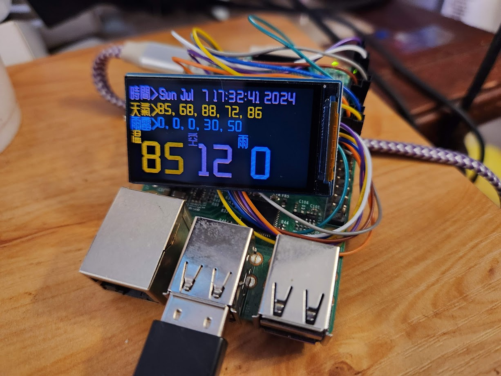

# Kumosys2024
* Home automation stuff a la Jojess
* Mostly here for me!
* Need to document the libs I'm borrowing x3

# AUTHOR
discord : jojess \
fedi : https://nyxa.jojess.net \
gmail : jojessfournier \

# LICENSE
Available under terms of GPLv3 'cuz am lazy https://www.gnu.org/licenses/gpl-3.0.en.html

# SCREENCAPS

