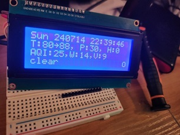

# Kumosys2024
* Home automation stuff a la Jojess
* Mostly here for me!

# LIB CREDITS
* lcd2004 - creative commons - [shaoziyang - lib_lcd1602_2004_with_i2c](https://github.com/liyuanhe211/Micropython_LCD1602_LCD2004_I2C_Lib)
* st7789b - unrestricted - [waveshareteam - LCD_1inch9](https://github.com/waveshareteam)

# DOCS
[doc/WSL_PICO_SETUP.md - Connecting USB Devices to WSL applications](doc/WSL_PICO_SETUP.md)
[doc/LCD2004.md - LCD2004 I2C PICO](doc/LCD2004.md)

# SCREENCAPS
* python - st7789b/pi2clock.py \
 \
* micropython - lcd2004/picolcdclock.py \
 \
 \
 \

# LICENSE
* This project available under terms of [GPLv3](LICENSE) 'cuz am lazy https://www.gnu.org/licenses/gpl-3.0.en.html
* lcd2004 library is available under the [Creative Commons license](LICENSECC)

# AUTHOR
discord : jojess \
fedi : https://nyxa.jojess.net \
gmail : jojessfournier
