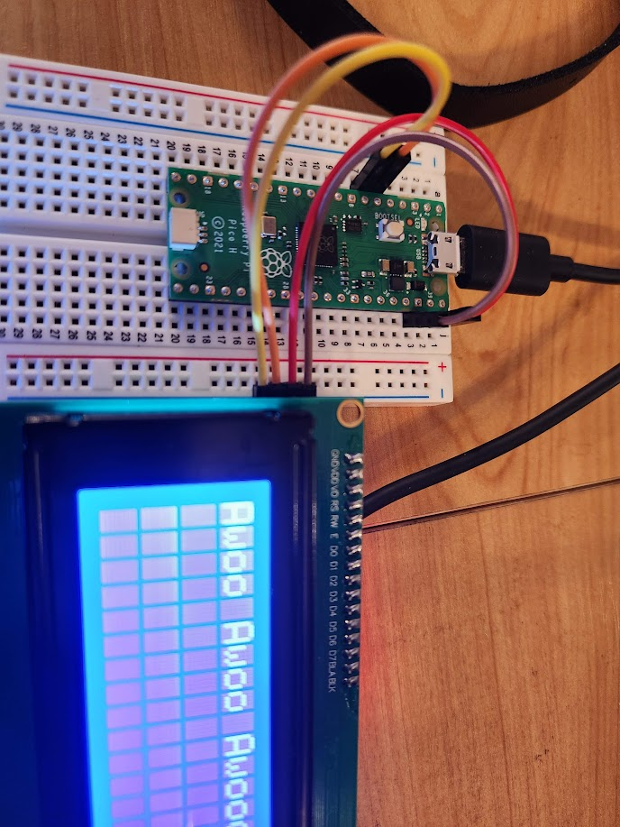

# I2C display to rp pico


# I2C 2004 LCD Module 20x04 LCD

```
sudo ~/py/bin/mpremote mip install github:mcauser/micropython-pcf8574
sudo ~/py/bin/mpremote mip install github:mcauser/micropython-pcf8574/examples
```

# Power supply: 5v; I2C address: 0x27; wiring method: GND—GND, VCC—VCC, SDA—A4, SCL—A5. 

* ye 
```
pico pin 39 ( VSYS, 3.3v ) => LCD2004 I2C VCC  [ red    ]
pico pin 33 ( GND )        => LCD2004 I2C GND  [ brown  ] 
pico pin 6 (I2C0 SDA )     => LCD2004 I2C SDA  [ orange ] 
pico pin 7 (I2C0 SCL )     => LCD2004 I2C SCL  [ yellow ] 
A0, A1, A2 jumpers open, address at 0x27
```

![lcd2004 controller](img/lcd2004