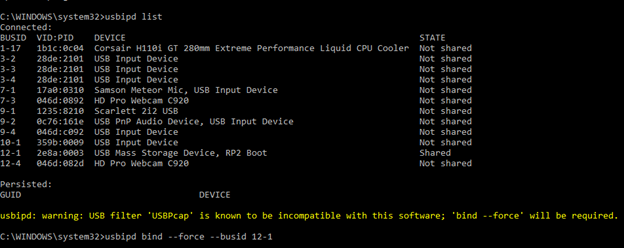

# usbipd cheat sheet

`usbipd list` \
 \
`usbipd bind --force --busid 00-00` \
 \
`usbipd attach --wsl --busid 00-00` \

`usbipd attach --wsl -a -i 2e8a:0005`

* automodem .bat:
`runas /user:Administrator C:\Progra~1\usbipd-win\usbipd.exe attach --wsl -a -i 2e8a:0005`
