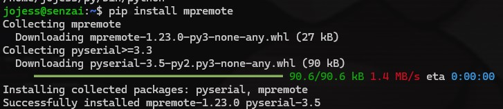
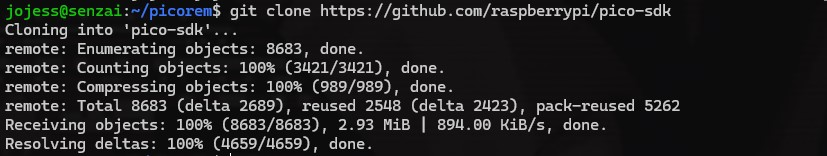
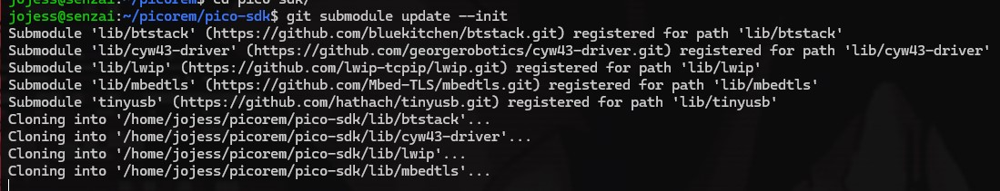

# WSL / RP Pico Setup
##Connecting USB Devices to WSL applications

0. have WSL v2 debian 12, git, etc
```
sudo apt install git xxd dhex git cmake gcc-arm-none-eabi libnewlib-arm-none-eabi libstdc++-arm-none-eabi-newlib build-essential pkg-config libusb-1.0-0-dev python3.11-venv usbutils
```

1. get usbipd [ cmd.exe, administrator ] \
[Install usbipd: https://github.com/dorssel/usbipd-win/releases ](https://github.com/dorssel/usbipd-win/releases) \
[More info: https://learn.microsoft.com/en-us/windows/wsl/connect-usb ](https://learn.microsoft.com/en-us/windows/wsl/connect-usb) \
`dism.exe /online /enable-feature /featurename:Microsoft-Windows-Subsystem-Linux /all /norestart` \
`usbipd list` \
 \
`usbipd bind --force --busid 00-00` \
 \
`usbipd attach --wsl --busid 00-00` \


2. configure python venv [ wsl / bash / user ] \
`chmod +x py/bin/activate` \

```python3 -m venv py``` \
 \
```source py/bin/activate ```\

3. install pyserial & mpremote \
`pip install mpremote` \


4. clone pico-sdk to new project
```
mkdir ~/picorem
cd ~/picorem
git clone -b master https://github.com/raspberrypi/pico-sdk
git clone -b master https://github.com/raspberrypi/pico-examples.git

git config --global --add safe.directory ${HOME}/picorem/pico-sdk

cd pico-sdk
mkdir build
cd build

export PICO_SDK_PATH=${HOME}/picorem/pico-sdk
cmake ..
cmake ..	#see note 2 below
make 
```




5. picotool
```
export PICO_SDK_PATH=${HOME}/picorem/pico-sdk
cd ~/picorem   
git clone "https://github.com/raspberrypi/picotool"
sudo cp udev/99-picotool.rules /etc/udev/rules.d/
export LIBUSB_ROOT=${HOME}/picorem/picotool
cd picotool
mkdir build
cd build
cmake ..
make
sudo ./picotool info
```

6. pico mode switching

```
sudo ./picotool/picotool info
# No accessible RP2040 devices in BOOTSEL mode were found.

/mnt/c/Program\ Files/usbipd-win/usbipd.exe list | egrep RP2
# 12-1   2e8a:0003  USB Mass Storage Device, RP2 Boot                             Attached

/mnt/c/Program\ Files/usbipd-win/usbipd.exe bind --force --busid 12-1 # needs to be run from admin command prompt, gdi
/mnt/c/Program\ Files/usbipd-win/usbipd.exe attach --wsl --busid 12-1

sudo ./picotool/picotool info
# Program Information
#  name:            MicroPython
#  version:         v1.23.0
#  features:        thread support
#                   USB REPL
#  frozen modules:  aioble/security, aioble/l2cap, aioble/client, aioble/central, aioble/server, aioble/peripheral, aioble/device, aioble/core, aioble, urequests, webrepl_setup, webrepl, ssl, ntptime, mip,
#                   requests, neopixel, dht, ds18x20, onewire, uasyncio, asyncio/stream, asyncio/lock, asyncio/funcs, asyncio/event, asyncio/core, asyncio, _boot_fat, _boot, rp2


/mnt/c/Program\ Files/usbipd-win/usbipd.exe bind --force --busid 12-1
/mnt/c/Program\ Files/usbipd-win/usbipd.exe attach --wsl --busid 12-1

sudo ~/py/bin/mpremote

sudo ~/py/bin/mpremote fs ls

```


99. Modify .bashrc etc \
`chmod +x py/bin/activate`
```
${HOME}/py/bin/activate
export PATH=${HOME}/py/bin:${PATH}
export PICO_SDK_PATH=${HOME}/picorem/pico-sdk
export LIBUSB_ROOT=${HOME}/picorem/picotool
```

