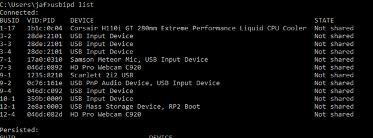
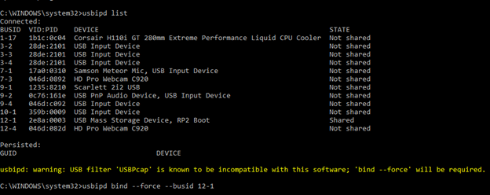
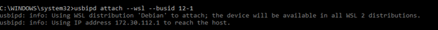

# WSL / RP Pico Setup

##Connecting USB Devices to WSL applications##

Install usbipd:
https://github.com/dorssel/usbipd-win/releases

More info:

https://learn.microsoft.com/en-us/windows/wsl/connect-usb

`usbipd list`

`usbipd bind --force --busid 00-00`

`usbipd attach --wsl --busid 00-00`

`sudo apt install python3.11-venv`

`python3 -m venv py`
